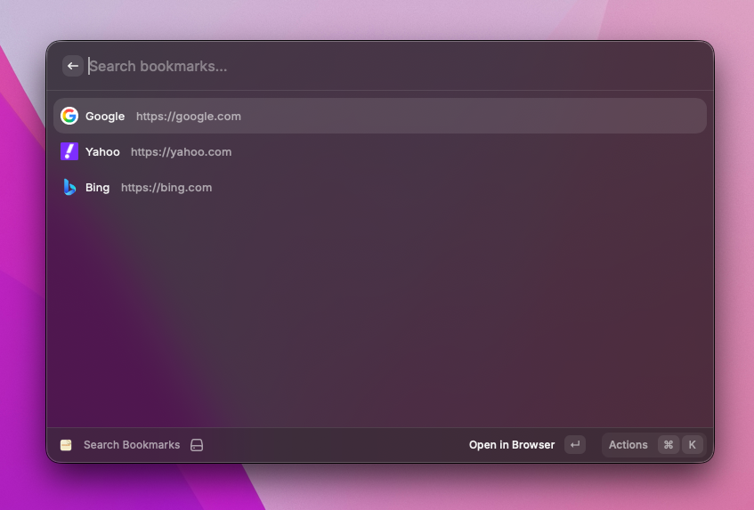

#  DOGEAR



Raycast extension for fuzzy searching bookmarks from a YAML config file and opening them in the browser.
DOGEAR uses the same `config.yaml` format as [fzf-bookmark-opener](https://github.com/flexphere/fzf-bookmark-opener).
If you already have a config file at `~/.config/fzf-bookmark-opener/config.yaml`, you can point DOGEAR directly to it — no migration needed.

## Features

- Fuzzy search across all bookmarks
- Favicon display for each bookmark
- Open in browser or copy URL to clipboard
- Edit bookmark title and URL directly from Raycast
- Dynamic Placeholders in URLs (like Raycast QuickLinks)
  - `{clipboard}` — automatically inserts clipboard contents into the URL
  - `{argument name="..." default="..."}` — prompts for input before opening
- YAML-based configuration

## Installation

### Raycast Store

Search for "DOGEAR" in the Raycast Store.

### Development Build

```bash
npm install
npm run dev
```

## Configuration

Set the **Config File Path** preference in Raycast to point to your `config.yaml`.

### config.yaml format

```yaml
bookmarks:
  - title: "GitHub"
    url: "https://github.com"
  - title: "Google Cloud Console"
    url: "https://console.cloud.google.com"
```

Each entry requires `title` and `url` fields. Comments (`#`) can be used to organize bookmarks by category.

### Dynamic Placeholders

You can use Dynamic Placeholders in bookmark URLs, similar to [Raycast QuickLinks](https://manual.raycast.com/quicklinks).

#### Clipboard

Use `{clipboard}` to insert the current clipboard text into the URL:

```yaml
bookmarks:
  - title: "Google Search (Clipboard)"
    url: "https://google.com/search?q={clipboard}"
```

#### Argument

Use `{argument name="..."}` to prompt for input when opening the bookmark:

```yaml
bookmarks:
  - title: "Google Translate"
    url: "https://translate.google.com/?sl={argument name="source" default="auto"}&tl={argument name="target"}&text={argument name="word"}&op=translate"
```

You can also combine `{clipboard}` and `{argument}` in the same URL.

## License

MIT
